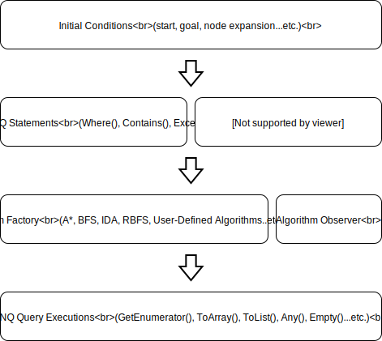

# LINQ to A\*

[](https://travis-ci.org/rvhuang/linq-to-astar) [](https://dev.azure.com/rvhuang/_apis/public/build/definitions/31750fb1-11f7-41f3-9a90-66f5a70f0bc6/3/badge) [](https://github.com/rvhuang/linq-to-astar/blob/master/LICENSE) [](https://www.nuget.org/packages/linq-to-astar/) [](https://lgtm.com/projects/g/rvhuang/linq-to-astar/alerts/)

**LINQ to A\*** is a [POC](https://www.oxfordlearnersdictionaries.com/definition/english/proof-of-concept) aimed to bring LINQ to [A\*](https://en.wikipedia.org/wiki/A*_search_algorithm) and other heuristic search algorithms. The library enables LINQ to be used as the query expression to the algorithm. To put it simply, **A\* written in C#, used with LINQ**.

The library defines a set of generic APIs that can be applied to any problem, as long as the problem suits the algorithm. By taking advantage of the power of LINQ, the library is not only about re-implementing the algorithms in C#, but also giving new ability and flexibility to the algorithms.

## How It Works

The following figure gives a brief overview about how the librarly works. 

[](docs/how-it-works.svg)

The initial conditions are given with the APIs called **Factory Method**. The solution is produced when one of query executions is called.

## Getting Started

The snippet below shows the LINQ expression used to find shortest path between `start` and `goal` on a 40 \* 40 map. The example utilizes the types defined in the package [System.Drawing.Primitives](https://www.nuget.org/packages/System.Drawing.Primitives/). 

```csharp
var start = new Point(5, 5);
var goal = new Point(35, 35);
var boundary = new Rectangle(0, 0, 40, 40);
var unit = 1;

// The initialization of A* algorithm
// with the factory that gets possible steps from current step.
var queryable = HeuristicSearch.AStar(start, goal, (step, lv) => step.GetFourDirections(unit));

// See description below.
var solution = from step in queryable.Except(GetMapObstacles()) // 1.
               where boundary.Contains(step)                    // 2.
               orderby step.GetManhattanDistance(goal)          // 3.
               select step;

// Each step of the shortest path found by A* algorithm.
foreach (var step in solution)
{
    Console.WriteLine(step);
}
```

The LINQ expression consists of the following clauses:

1. The `Except()` eliminates invalid steps during the process.
2. The `where` clause sets up the boundary but can also be used for checking invalid steps.
3. The `orderby` clause serves as *h(n)* (aka [Heuristic](https://en.wikipedia.org/wiki/Heuristic)) that estimates the cost of the cheapest path from *n* (the current step) to the goal.

If a solution is found (in deferred execution), the enumeration returns each of steps. Otherwise, an empty collection is returned.

See the document [Expression Examples](docs/Expression-Examples.md) for more examples.

### Console Examples

* [Classic Pathfinding](examples/Heuristic.Linq.Example.PathFinding/) 
* [8-Puzzle Solving](examples/Heuristic.Linq.Example.EightPuzzle/)

### Live Playground

Check out [Pathfinding Laboratory](https://pathfinding-lab.codedwith.fun/) and play with the library.

## Algorithms
### Built-in Algorithms

The following algorithms are shipped with the library.

|Algorithm|Factory Method|Remarks|
|----------|----------|----------|
|[A\*](https://en.wikipedia.org/wiki/A*_search_algorithm)|`AStar<TStep>()`||
|[Best-first Search](https://en.wikipedia.org/wiki/Best-first_search)|`BestFirstSearch<TStep>()`||
|[Recursive Best-first Search](http://cs.gettysburg.edu/~tneller/papers/talks/RBFS_Example.htm)|`RecursiveBestFirstSearch<TStep>()`||
|[Iterative Deepening A\*](https://en.wikipedia.org/wiki/Iterative_deepening_A*)|`IterativeDeepeningAStar<TStep>()`||
|[Dijkstra](https://en.wikipedia.org/wiki/Dijkstra%27s_algorithm)|`AStar<TStep>()`|Without `orderby` clause. (v1.1.0)|

### User-defined Algorithms

You are able to implement and use your customized algorithms with the following steps:

1. Create a type that implements `IAlgorithm` interface.
2. Register the type and name of the algorithm with `HeuristicSearch.Register<TAlgorithm>()`.
3. Apply LINQ expressions to your algorithm with `HeuristicSearch.Use()`.

```csharp
// MyAlgorithmClass has to implement IAlgorithm interface.
HeuristicSearch.Register<MyAlgorithmClass>("MyAlgorithm");

var queryable = HeuristicSearch.Use("MyAlgorithm", start, goal, getFourDirections);
var solution = from step in queryable.Except(GetObstacles())
               where boundary.Contains(step)
               orderby step.GetManhattanDistance(goal)
               select step;
```

### Algorithm Observation (v1.2.0)

The solution finding process of an algorithm can be observed by implementing the interface `IAlgorithmObserverFactory<TStep>` and passing its instance to the new signature of the factory method. The observed algorithm will: 

1. Create an `IProgress<T>` object with the `IAlgorithmObserverFactory<TStep>` instance, where `T` is `AlgorithmState<TFactor, TStep>`.
2. Report the progress by creating a series of `AlgorithmState<TFactor, TStep>` instances and passing each of them to `IProgress<T>.Report()`.

The following snippet shows how to observe A\* algorithm.

```csharp
// Implementing IAlgorithmObserverFactory<TStep> interface.
var factory = new MyAlgorithmObserverFactory();
var queryable = HeuristicSearch.AStar(start, goal, getFourDirections, null, factory);
var solution = from step in queryable.Except(GetObstacles())
               where boundary.Contains(step)
               orderby step.GetManhattanDistance(goal)
               select step;

// The algorithm starts finding the solution while reporting the progress.
var array = solution.ToArray();
```

The Open List Analysis of [Pathfinding Laboratory](https://pathfinding-lab.codedwith.fun/) largely relies on this feature.

## Supported LINQ Clauses and Operations

### Projection

* `Select()`
* `SelectMany()`

### Condition

* `Where()`
* `Except()`
* `Contains()`

### Heuristic Function 

* `OrderBy()` - serves as heuristic function.
* `OrderByDescending()` - serves as reverse heuristic function.
* `ThenBy()` - serves as heuristic function but will only be referred when previous one evaluates two nodes as equal.
* `ThenByDescending()` - serves as reverse heuristic function but will only be referred when previous one evaluates two nodes as equal.

### Execution

The operations below provide optimized performance to replace `Enumerable` extensions.

* `ToArray()`
* `ToList()`
* `Any()`
* `Count()`
* `LongCount()`
* `First()`
* `FirstOrDefault()`
* `Last()`
* `LastOrDefault()`

### Misc

* `Reverse()` - inverts the order of solution from `start` -> `goal` to `goal` -> `start`.

## Roadmap

|Milestone|Release Date (NuGet)|
|----------|----------|
|1.0.0 Preview|Q2 2018|
|1.0.0|Q3 2018|
|1.1.0|Q4 2018|
|1.2.0|Q1 2019|
|1.3.0|Q2 2019|

## Platform and Dependencies

* [.NET Standard 2.0](https://docs.microsoft.com/en-us/dotnet/api/?view=netstandard-2.0)
* [System.Numerics.Vectors](https://www.nuget.org/packages/System.Numerics.Vectors/) (>= 4.4.0)
* [System.Drawing.Primitives](https://www.nuget.org/packages/System.Drawing.Primitives/) (>= 4.3.0)

## License

The MIT License (MIT) - feel free to copy, modify and use the source code in your computer science homework (grades not guaranteed though).

Copyright © Robert Vandenberg Huang ([rvh.omni@gmail.com](mailto:rvh.omni@gmail.com))
