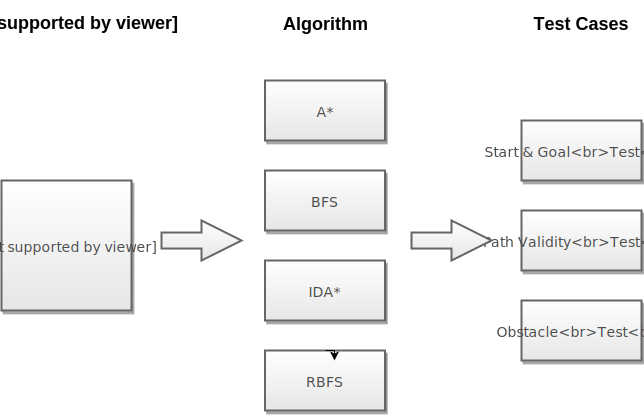

# Test

The file describes the purpose of test project.

## Validity Test

The test class covers all algorithms and consists of three test cases:

1. Test if first step of the solution is equal to `start` and last step is equal to `goal`.
2. Test if the solution is continuous. Distance between `X` or distance between `Y` of each two steps must be exactly equal to `unit`.
3. Test if the solution contains obstacles.

Validity test does not verify whether the path is optimized or best solution.

## Expression Test

The test class covers variations of LINQ expressions. More test cases to be added.